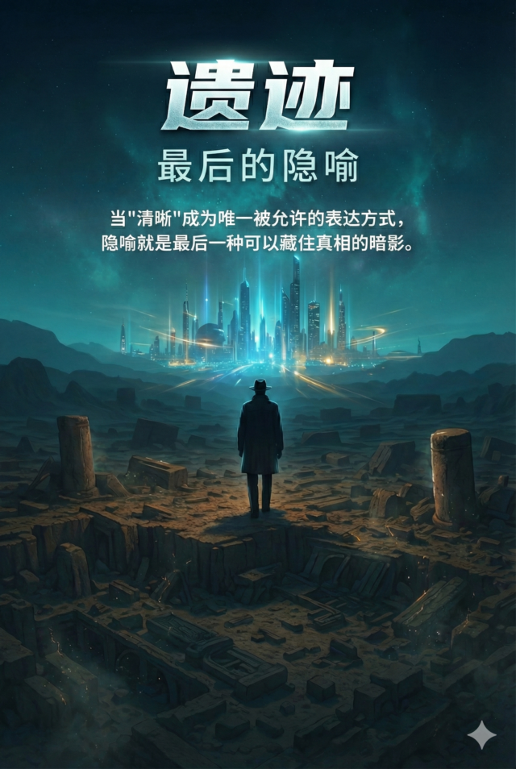

# 《遗迹：最后的隐喻》



---

## 一件小事

有一天，一个孩子写了一篇作文。

他写的是"外婆的手像树皮"。

系统把它改成了"外婆的手皮肤粗糙"。

分数从 47 分变成 89 分。

孩子很高兴。老师很满意。家长群里一片祥和。

没有人问：**那棵树去了哪里？**

---

## 几个问题

你有没有发现，现在打字的时候，有些念头还没成形就消失了？

不是被别人删掉。是你自己觉得"这样说不够清楚"，于是就不说了。

那些被你删掉的念头，后来怎么了？  
它们去了哪里？  
还是说——它们从来就没能存在过？

---

如果"清晰"是一种美德，那"含混"是不是一种罪？

如果"准确"是一种能力，那"欲言又止"是不是一种缺陷？

如果所有人都只说能被听懂的话——  
那些**只能在暗影里存活的意思**，还有没有容身之地？

---

## 一个发现

在一个不可能有人类活动的地层里，有人挖出了一件东西。

它的年代和所有教科书都对不上。  
它的材质和所有已知技术都不匹配。  
但它的同位素比例，明确地说：这是地球的东西。

最初所有人都愿意相信那是外星人留下的。  
因为"外星人"是一个很好的解释——震撼、遥远、模糊。  
你可以研究一百年也不用给出答案。

但如果它不是外星人的呢？  
如果制造它的，是人类自己呢？  
如果曾经有过一段文明，走得比我们更远——然后被某种东西抹掉了呢？

**是什么样的东西，需要被从时间线上删除？**  
**是什么样的错误，连记忆都不被允许保留？**

---

## 一些痕迹

你会在这本书里遇到一些人。

有人在家长群里打好了一句话，然后一个字一个字删掉了。  
有人在会议室里提出了一个问题，然后眼看着它沉入沉默。  
有人写了两份报告——一份交上去，一份锁在加密盘里。  
有人的眼睛三天前是亮的，三天后就不亮了。

他们不是英雄。他们没有反抗什么。  
他们只是在活着。  
在一个**"说清楚"比"说真话"更安全的世界**里，努力地活着。

---

## 一个选择

你可以现在就关掉这个页面。

这不是一个关于勇敢反抗的故事。  
这里没有天选之人，没有热血逆袭，没有最后一刻的奇迹。  
这里只有一群人，在每一步都做了"正确选择"，然后一起走进了某个地方。

如果你需要的是一个答案，这本书不会给你。  
如果你需要的是一种确定感，这本书会让你更不安。

但如果你愿意和这些问题待一会儿——  
不急着回答，不急着判断，只是看着它们在黑暗里发光——

那就继续。

---

## 从哪里开始

`chapters/01/` —— 故事从一块不可能的地层开始。

或者你可以先看 `outline/`，如果你是那种"不搞清楚规则就没法进入故事"的人。

---

## 仓库结构

这是一个正在生长的档案库：

```
outline/   世界观设定、结构与角色——这本书的骨骼
chapters/  正文章节——这本书的血肉
docs/      世界内文书与删节档案——这本书的暗影
notes/     灵感碎片与伏笔清单——这本书的草稿纸
assets/    封面与视觉参考——这本书的皮肤
```

---

## 写作进度

- [ ] 序章 —— 还在被不断推翻
- [x] 第一部《出土》—— 连载中

这是一个公开的写作过程。  
你看到的不只是故事，还有它经历的删改、犹豫与自我质疑。

---

## 最后一个问题

**如果隐喻是最后一种可以藏住真相的方式——**

**当隐喻也被删除之后，还剩下什么？**

---

*This project is a work of fiction. All rights reserved.*
